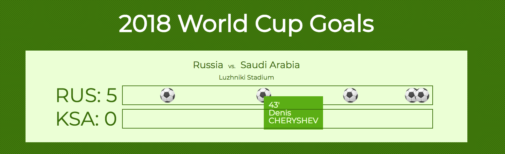

# 🌍 🏆 Goal Tracker React Challenge

Your ...goal... is to add specified react components onto this existing react app which displays completed or in-progress world cup games.

You should do the following -

- make a "goalTimeLine" component that takes the relevant props and displays a soccer ball emoji - ⚽️ - in a position that indicates the time it was scored in the game

- hovering over the soccer ball should display another compoment goalDetails that shows the time of goal and who scored it

HINTS:

- You will need to only render the events for each team which are goal events. Think about which array method you could use to get just the events you want.

- You can position the soccer balls using Absolute position (so long as you have t them in a container with position relative), and give them a left position that is equal to the time of the goal.

- You will need to massage the goal time string from the JSON api, to remove the apostrophe indicating minutes, ie change _40'_ to _40_

- you can apply styles using react like so https://zhenyong.github.io/react/tips/inline-styles.html

- for the "tooltip" style goal detail you can use another absolute position element _ inside _ the element containing the positioned soccer ball

- you can use CSS to conditionally render the tooltip without javascript by using nested css like _.soccer-ball:hover .tooltip { display: block}_

BONUS:

Further format the time string so that goals scored after regulation (in minutes after 90) display in the proper position
